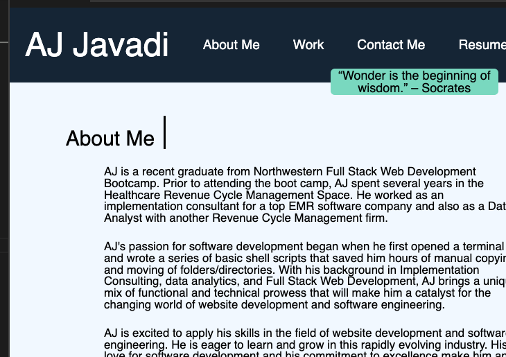

# AJs\_NW\_Portfolio

## Description

This will be a portfolio, showcasing the projects I work on while at Northwestern's Bootcamp. 

The site is currently hosted via Github pages, and can be accessed here:

[Github Pages] https://oshkoshbagoshh.github.io/AJs_NW_Portfolio/  

This will be a working portfolio, where I can continuously add the projects I complete while at Northwestern's bootcamp. The motivation for this project was to create a living portfolio, and as such, there will be continous updates as my strength as a Web Developer increases. 

I utilized basic HTML, CSS, and markdown for the documentation.

I also utilized wireframing to copy the structure of an example page that was supplied to us. 

## Table of Contents
- [AJs\_NW\_Portfolio](#ajs_nw_portfolio)
  - [Description](#description)
  - [Table of Contents](#table-of-contents)
  - [Installation](#installation)
  - [Usage](#usage)
  - [Credits](#credits)
  - [Installation](#installation-1)
  - [Usage](#usage-1)

## Installation 
- use git clone to clone the repo 
- open the index.html file in your browser of choice

## Usage
- use git clone to clone the repo
- open the index.html file in your browser of choice

- [Github Pages](https://oshkoshbagoshh.github.io/AJs_NW_Portfolio/)

## Credits 
- AJ Javadi
- w3 Schools 
  

## Installation

To install the project (or use something similar), all a user would need is Git, HTML, CSS, and Markdown. 

## Usage

Here is a screenshot of what the page will look like: 

